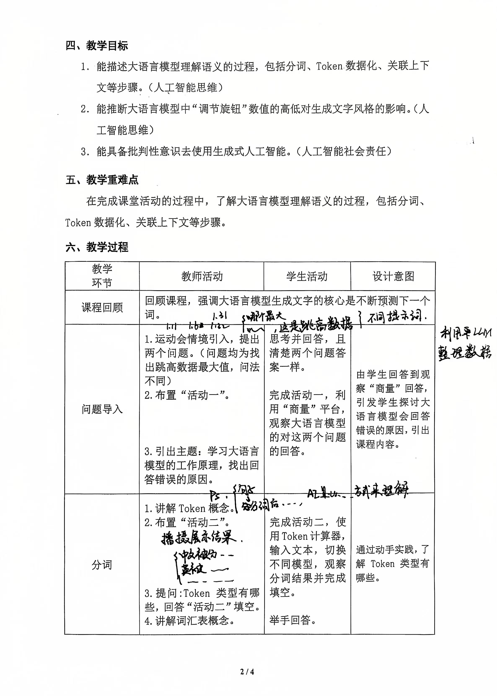
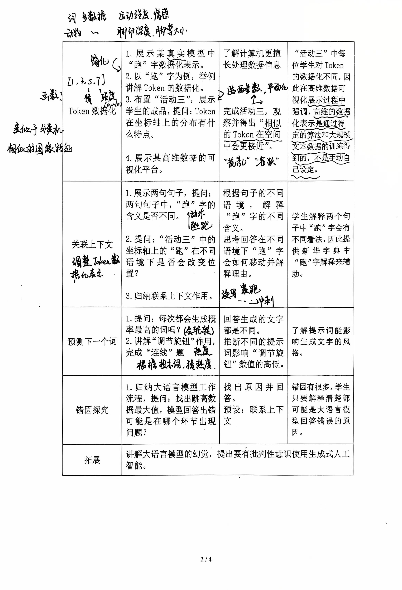
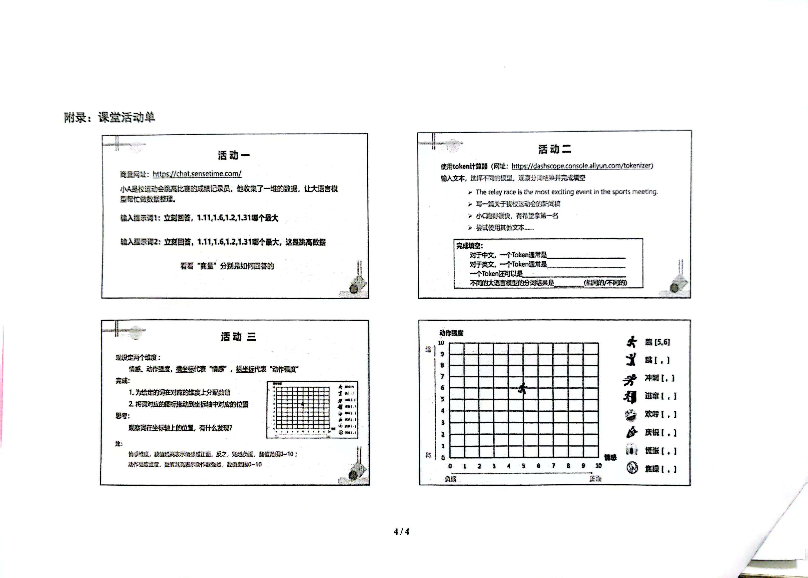

# 《大语言模型的语义理解》听课记录反

## 教学设计

## 思考感悟

顾老师《大语言模型的语义理解》这节课带着学生了解了大语言模型背后的工作原理。大语言模型中的数据存储是高维的，而数据的含义和关联更是复杂的，同时学生对于函数参数等知识的缺乏，让这一部分内容更加难以教学。而顾老师通过现场展示模型、两次简化模型、学生实践的方式，让学生理解大语言模型中是如何存储分词的含义和关联上下文内容。其中对于高维数据模型的转化让我茅塞顿开，将高维模型转换成只有两个参数的模型，通过坐标轴的图示和具体词汇在坐标轴上的位置，就让学生直观的理解了参数是如何影响到具体的词汇的含义，同时含义相近的词汇之间又是如何保持关联的。
顾老师的这节课让我深刻体会到了教学中化繁为简的重要性，尤其是在人工智能这种概念相对复杂的课程当中，这种教学方法不仅提高了学生的学习效率，也激发了他们对复杂概念的探索兴趣，是教学中帮助学生理解和掌握知识的关键。
